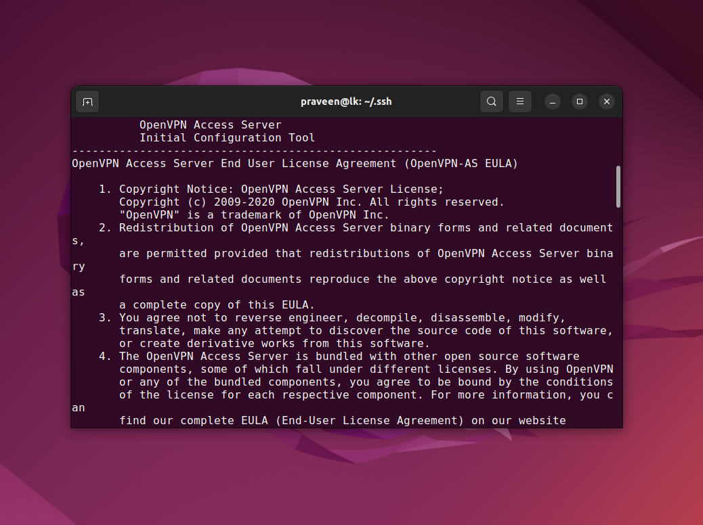
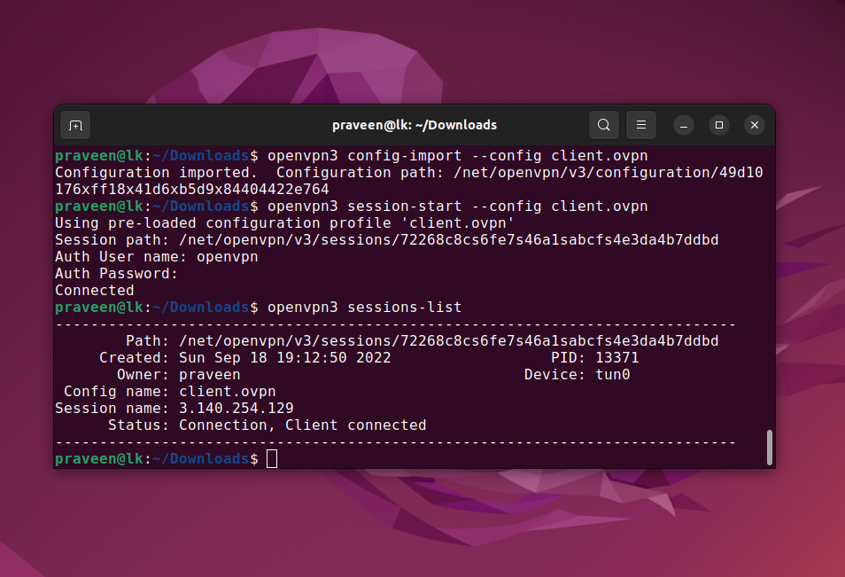

# OpenVPN Access Server

https://openvpn.net/


# Setup Access Server




# OpenVPN Status


# Connect to the OpenVPN Server

https://openvpn.net/vpn-server-resources/connecting/

```
apt install apt-transport-https
sudo wget https://swupdate.openvpn.net/repos/openvpn-repo-pkg-key.pub
sudo apt-key add openvpn-repo-pkg-key.pub
sudo wget -O /etc/apt/sources.list.d/openvpn3.list https://swupdate.openvpn.net/community/openvpn3/repos/openvpn3-jammy.list
sudo apt update
sudo apt install openvpn3
```


```
openvpn3 config-import --config client.ovpn
openvpn3 session-start --config client.ovpn
openvpn3 sessions-list
```


